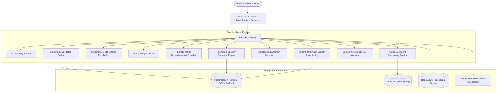

# Intelligent Land Record Digitization and Validation System
### Advanced Full-Stack MVP — Smart India Hackathon (SIH 2026)

[](https://fastapi.tiangolo.com)
[](https://nextjs.org)
[](https://postgis.net)
[](https://python.org)
[](https://www.typescriptlang.org)
[](https://tailwindcss.com)

---

## 1. Executive Summary & Problem Statement

Traditional land records in India (such as **Pattas, Chitta, Registered Sale Deeds, Field Measurement Books (FMB), Village Maps, and Tax Kist Receipts**) frequently suffer from:
* Low scan resolution, ink fading, physical paper decay, and skew.
* Multilingual text in regional scripts (Tamil தமிழ், Hindi हिन्दी, English).
* Inconsistent person spelling (e.g. `R. Kumar` vs `Ravi Kumar` vs `ரவிகுமார்`).
* Conflicting area measurements between paper deeds and actual spatial cadastral parcel geometries.
* Duplicate titles and fraudulent title amendments claiming overlapping boundaries.

The **Intelligent Land Record Digitization and Validation System** is an enterprise-grade AI, OCR, and Cadastral GIS platform designed to transform legacy paper records into **structured, searchable, PostGIS-validated, and tamper-evident digital titles** with explainable fraud risk scoring and human-in-the-loop verification.

---

## 2. System Architecture



---

## 3. Key Differentiators & Features

1. **Multilingual OCR & Document Studio**:
   - High-resolution (300 DPI) PyMuPDF conversion with OpenCV CLAHE contrast enhancement and automatic deskew rotation.
   - Character recognition and bounding box extraction for **English, Tamil (தமிழ்), and Hindi (हिन्दी)**.
   - Interactive studio with side-by-side zoom/pan canvas, bounding box overlays, and bidirectional field-to-canvas highlighting.

2. **Phonetic & Multilingual Name Normalization**:
   - Unicode NFKC standardisation, title/honorific stripping.
   - Multilingual transliteration mapping (`ரவிகுமார்` -> `ravi kumar`).
   - Standard Soundex phonetic hashing and Levenshtein similarity scoring to classify matches (`MATCH`, `PROBABLE_MATCH`, `POSSIBLE_MATCH`, `NO_MATCH`).

3. **Explainable Validation Engine**:
   - Transparent composite score (0-100%) calculated across 7 modular rules:
     * `OwnerConsistencyRule`: Name and parentage alignment against registration chain.
     * `SurveyNumberRule`: Format, subdivision validity, duplicate survey registry checks.
     * `AreaConsistencyRule`: Deed stated area vs PostGIS polygon calculated area with percentage deviation.
     * `LocationConsistencyRule`: Administrative hierarchy validation (Village -> Taluk -> District).
     * `DateConsistencyRule`: Future date anomaly detection and chronological consistency.
     * `BoundaryOverlapRule`: PostGIS spatial intersection query to detect physical encroachments.
     * `OCRConfidenceRule`: Optical clarity assessment.

4. **Cadastral GIS Map (MapLibre GL JS)**:
   - Full vector/satellite cadastral map rendering survey polygon parcels in EPSG:4326.
   - Color-coded parcels by validation risk level (Emerald: Clean, Amber: Area Warning, Rose: Boundary Overlap / Critical).
   - Click-to-inspect parcel card displaying survey number, owner, stated area, GIS area, deviation %, and direct record link.

5. **Human-in-the-Loop Verification & Audit Ledger**:
   - Revenue officer decision portal with field correction forms (mandatory justification reason).
   - One-click statutory Approval / Rejection with timestamped cryptographic snapshot creation.
   - Append-only immutable audit ledger recording every change (`who`, `what`, `when`, `old_value`, `new_value`, `reason`, `ip_address`).

6. **Context-Grounded AI Assistant (No Hallucinations)**:
   - RAG conversational assistant answering officer queries (e.g. *"Why was this record flagged?"*, *"What is the GIS area variance?"*).
   - Grounded strictly in active database records, OCR text, and validation findings with source citations.

7. **Statutory Report & Certificate Exporter**:
   - Instant PDF Validation Certificate generation via ReportLab.
   - Full registry CSV & REST JSON export.

---

## 4. Technology Stack

| Layer | Technology |
|---|---|
| **Frontend** | Next.js 14 (App Router), React 18, TypeScript, Tailwind CSS, MapLibre GL JS, Recharts, Lucide Icons, Zustand |
| **Backend** | Python 3.12, FastAPI, SQLAlchemy 2.0 (Async), Pydantic v2, Uvicorn |
| **Database & GIS** | PostgreSQL 16 + PostGIS, SQLite + aiosqlite (zero-dependency fallback), Shapely, GeoJSON |
| **Document Processing & OCR** | PyMuPDF (fitz), OpenCV (cv2), Pillow, Multilingual Cadastral Parser |
| **Security & Auth** | JWT Access & Refresh Tokens, bcrypt password hashing, Role-Based Access Control (RBAC) |
| **Deployment** | Docker, Docker Compose, MinIO, Redis |

---

## 5. Quick Start & Local Development

### Option A: Local Zero-Dependency Run (Fastest)

#### 1. Backend Setup (FastAPI)
```bash
# In repository root:
python -m venv apps/api/venv
apps/api/venv/Scripts/pip install -r apps/api/requirements.txt

# Run test suite:
apps/api/venv/Scripts/python -m pytest -v

# Generate sample deed assets & seed realistic demo data:
apps/api/venv/Scripts/python apps/api/scripts/generate_sample_assets.py

# Start FastAPI server on port 8000:
apps/api/venv/Scripts/uvicorn app.main:app --app-dir apps/api --host 0.0.0.0 --port 8000 --reload
```
* Interactive API Documentation: [http://localhost:8000/api/docs](http://localhost:8000/api/docs)

#### 2. Frontend Setup (Next.js)
```bash
# In a new terminal:
cd apps/web
npm install
npm run dev
```
* Web Portal: [http://localhost:3000](http://localhost:3000)

---

### Option B: Docker Compose (Full Production Stack)

```bash
docker compose up -d --build
```
Services started:
* **Frontend**: `http://localhost:3000`
* **FastAPI Backend**: `http://localhost:8000`
* **PostgreSQL + PostGIS**: `localhost:5432`
* **Redis**: `localhost:6379`
* **MinIO Console**: `http://localhost:9001`

---

## 6. Pre-Configured Demo Credentials

| Role | Email | Password | Access Scope |
|---|---|---|---|
| **Admin** | `admin@example.com` | `admin123` | Full administrative, validation, and audit controls |
| **Officer** | `officer@example.com` | `officer123` | Tahsildar human-in-the-loop review & approval |
| **Verifier** | `verifier@example.com` | `verifier123` | Cadastral GIS & field verification |
| **Viewer** | `viewer@example.com` | `viewer123` | Public land title registry lookup |

*(Fast-switch demo buttons are embedded on the login page and top navbar).*

---

## 7. SIH 2026 3-Minute Demo Walkthrough

1. **Login & Dashboard Overview**:
   - Log in as `admin@example.com`.
   - Observe aggregate metrics, records processed today, and live risk distribution donut chart.

2. **Upload Legacy Land Document**:
   - Navigate to **Documents** -> **Upload New Documents**.
   - Select `land_record_145_patta.pdf` from `data/sample_docs/`.
   - Observe real-time multi-stage visualizer (PDF Conversion -> CLAHE Enhancement -> Multilingual OCR -> Entity Extraction -> Cadastral Validation).

3. **Interactive Document Intelligence Studio**:
   - Inspect the generated document page.
   - Click **"Owner Name"** or **"Survey Number"** in the extracted entities list. Observe the document canvas smoothly locate and glow-highlight the corresponding OCR bounding box!

4. **Cadastral Validation & Area Mismatch Detection**:
   - View Record `LR-TN-ERD-00101` (Survey 145/2A).
   - See the transparent validation score (e.g. 78.5%) and explainable rule breakdown:
     * Document Deed Area: `2.45 Acres`
     * GIS Cadastral Parcel Area: `2.39 Acres`
     * Deviation: `2.45%` (Acceptable variance under 5% tolerance threshold).

5. **Critical Fraud Risk Detection**:
   - Inspect Record `LR-TN-ERD-00103` (Altered Title `145/2A-CLONE`).
   - Observe the **CRITICAL** risk banner flagging two fraud indicators:
     1. **Date Anomaly**: Future registration date (`2028-11-10`).
     2. **Boundary Overlap**: Physical spatial encroachment overlapping adjacent parcels `145/2A` and `145/2B`.

6. **Interactive Cadastral GIS Map**:
   - Navigate to **GIS Parcel Map**.
   - Switch between **Cadastral Vector** and **Satellite Imagery**.
   - Click on Parcel `145/2A` to view the floating Inspector Card showing survey boundaries, area calculation, and direct link to the verified title.

7. **Human-in-the-Loop Review & Audit Log**:
   - Open **Verification** portal.
   - Click **Approve Record** with reviewer notes.
   - Navigate to **Audit Logs** to view the immutable entry with officer identity and timestamp.
   - Download the official **PDF Validation Certificate**.

---

## 8. License

Developed for **Smart India Hackathon (SIH 2026)**.
Licensed under the Apache 2.0 License.
