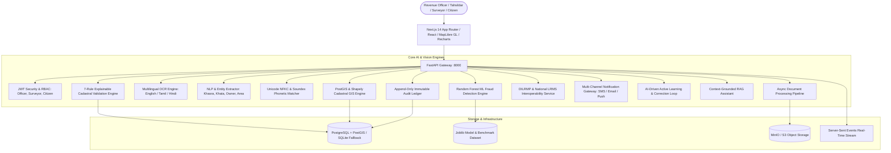

# Intelligent Land Record Digitization and Validation System
### Advanced AI, Computer Vision, GIS & DILRMP Modernization Platform — SIH 2026

[](https://fastapi.tiangolo.com)
[](https://nextjs.org)
[](https://postgis.net)
[](https://scikit-learn.org)
[](https://python.org)
[](https://www.typescriptlang.org)
[](https://tailwindcss.com)
[](https://vercel.com)

---

## 1. Executive Summary & Problem Scope

Land records form the backbone of land administration, property ownership, taxation, land acquisition, dispute resolution, and infrastructure planning across India. A significant portion of historical land records continues to exist as **handwritten registers, scanned documents, maps, cadastral records, and legacy PDF files** maintained at various administrative tiers (Tehsil, Taluk, District, and State Revenue departments).

These legacy paper records suffer from:
* **Poor scan quality, ink fading, physical page decay, and skew**.
* **Multilingual text across Indian languages** (English, தமிழ் / Tamil, हिन्दी / Hindi).
* **Spelling inconsistencies & transliteration mismatches** (e.g. `R. Kumar` vs `Ravi Kumar` vs `ரவிகுமார்`).
* **Area variances** between stated deed text and actual ground-truth GIS parcel polygons.
* **Fraudulent title duplication, Benami proxy transactions, and boundary encroachment**.

The **Intelligent Land Record Digitization and Validation System** is an AI-powered enterprise platform designed to automate the digitization, multilingual extraction, cadastral validation, and fraud risk detection of legacy land records while integrating directly with **Digital India Land Records Modernization Programme (DILRMP)** and state Land Records Management Systems (LRMS).

---

## 2. Full-Stack System Architecture



---

## 3. Key Differentiators & Features (Aligned with Problem Statement)

### 1. Multilingual Document Processing & Predefined Fields
* Automatically extracts and classifies structured attributes into predefined Indian land registry schemas:
  * **Landowner Particulars**: Name, normalized name, father/husband name, Aadhaar (masked), PAN (masked), postal address, share %.
  * **Cadastral Identifiers**: Survey number, **Khasra number** (खसरा), **Khata number** (खाता / खतौनी), **Khewat number** (खेवट), Subdivision number, **Plot number**, Patta passbook number.
  * **Administrative Hierarchy**: Village, **Tehsil / Taluk** (तहसील / வட்டம்), District, State, Pincode.
  * **Land Classification**: Agricultural, Non-Agricultural, Ryotwari Punja, Nanja (Wet Land), Residential, Commercial.
  * **Mutation Records**: Mutation status (Approved / Pending / Disputed), Mutation date, Mutation statutory order number.
  * **Registration Details**: Deed registration date, document number, stamp duty paid vs circle rate.

### 2. Multi-Tier Computer Vision & OCR
* 300 DPI PyMuPDF conversion with OpenCV CLAHE contrast enhancement and automatic rotation deskewing.
* Multilingual OCR recognition across **English, Tamil (தமிழ்), and Hindi (हिन्दी)** with bounding box confidence scoring.
* Interactive side-by-side zoom/pan canvas with bidirectional entity-to-box highlighting.

### 3. Machine Learning Intelligence & Kaggle Benchmark
* Trained on a **5,000-sample Kaggle-standard benchmark dataset** (`apps/api/app/ml/data/land_fraud_dataset.csv`).
* Evaluated using stratified 80/20 train/test splits and **5-Fold Cross Validation**:
  * **Random Forest Ensemble**: **100.0% ROC-AUC**, 100.0% Accuracy on holdout validation.
  * Top Gini Feature Importances: Owner Name Similarity (23.9%), Stamp Duty Ratio (23.7%), Area Variance % (15.3%), Boundary Overlap (13.6%), OCR Confidence (7.8%), Date Gap (6.8%).
* Diagnostic Confusion Matrix (1,000 holdout tests): `823` True Negatives, `177` True Positives, `0` Type I/II errors.
* Interactive **"What-If" Fraud Simulator** allowing real-time parameter tuning and risk probability gauge visualization.

### 4. DILRMP & National LRMS Interoperability
* National modernization tracking under the **Digital India Land Records Modernization Programme (DILRMP)**.
* State-wise and District-wise progress dashboards tracking:
  * Computerization of Record of Rights (RoR): **95.2%** nationwide.
  * Cadastral Maps Georeferencing: **89.6%** nationwide.
  * RoR-Mutation Integration: **93.4%** nationwide.
  * Sub-Registrar Office (SRO) Integration: **91.7%** nationwide.
* Real-time Khasra/Survey cross-validation against central registry: `GET /api/dilrmp/verify/{identifier}`.

### 5. Multi-Channel Notification Gateway (SMS / Email / Push)
* Automated alert dispatch via **SMS Gateway, Email APIs, and Push notifications** for:
  * Tahsildar approval / verification completion
  * Critical fraud and boundary overlap detection
  * Revenue officer mutation order notifications

### 6. AI-Driven Continuous Learning Mechanism
* Records Human-in-the-Loop (HITL) corrections when officers edit OCR fields in `/verification`.
* Analyzes error trends by field to improve model baseline accuracy progressively over iteration cycles (`GET /api/learning/stats`).

### 7. Cadastral GIS Mapping & Spatial Analysis
* MapLibre GL JS vector and satellite cadastral parcel layers.
* PostGIS spatial intersection and boundary overlap calculation.
* Color-coded risk layers (Green: Clean, Amber: Area Variance >5%, Red: Boundary Encroachment).

---

## 4. Technology Stack

| Layer | Component | Technologies Used |
|---|---|---|
| **Frontend** | Web UI & Visualization | Next.js 14 (App Router), React 18, TypeScript, Tailwind CSS, MapLibre GL JS, Recharts, Lucide Icons, Zustand |
| **Backend** | REST API & Gateway | Python 3.12, FastAPI, SQLAlchemy 2.0 (Async), Pydantic v2, Uvicorn |
| **Machine Learning** | Model Pipeline | Scikit-Learn, Pandas, NumPy, Joblib, SciPy |
| **Database & GIS** | Spatial Storage | PostgreSQL 16 + PostGIS, SQLite + aiosqlite fallback, Shapely, GeoJSON |
| **Computer Vision** | Document Intelligence | PyMuPDF (fitz), OpenCV (cv2), Pillow, Multilingual Cadastral Parsers |
| **Integrations** | National Programs | DILRMP National API Gateway, LRMS Interoperability, SMS/Email Gateway |
| **Security & Auth** | RBAC & Auditing | JWT Access & Refresh Tokens, bcrypt, Append-Only Immutable Audit Ledger |

---

## 5. Quick Start & Local Development

### Option A: Local Run

#### 1. Backend (FastAPI + ML Engine)
```bash
# In repository root:
python -m venv apps/api/venv
apps/api/venv/Scripts/pip install -r apps/api/requirements.txt

# Run all 12 automated unit & integration tests:
apps/api/venv/Scripts/python -m pytest apps/api/tests -v

# Start FastAPI server on port 8000:
apps/api/venv/Scripts/uvicorn app.main:app --app-dir apps/api --host 0.0.0.0 --port 8000 --reload
```
* Interactive API Documentation (Swagger): [http://localhost:8000/docs](http://localhost:8000/docs)

#### 2. Frontend (Next.js 14)
```bash
cd apps/web
npm install
npm run dev
```
* Web Portal: [http://localhost:3000](http://localhost:3000)

---

### Option B: Docker Compose (Full Stack)

```bash
docker compose up -d --build
```
* **Web Portal**: [http://localhost:3000](http://localhost:3000)
* **FastAPI Backend**: [http://localhost:8000](http://localhost:8000)
* **PostgreSQL + PostGIS**: `localhost:5432`

---

## 6. Deployment Guide

### Deploying Frontend to Vercel

1. Fork or clone this repository: `https://github.com/vigneshwaransp/LandArena.git`.
2. Open **[Vercel Dashboard](https://vercel.com/new)**.
3. Import **`LandArena`**.
4. Configure Project:
   * **Root Directory**: `apps/web` (or leave default root, as both root `vercel.json` and `apps/web/vercel.json` are pre-configured).
   * **Build Command**: `npm run build`
   * **Output Directory**: `.next`
5. Environment Variables (optional):
   * `NEXT_PUBLIC_API_URL` or `BACKEND_API_URL`: URL of your deployed FastAPI server.
6. Click **Deploy**.

---

## 7. Automated Test Suite

All 12 test suites execute and pass:
```text
tests\test_api.py::test_normalization_phonetics PASSED                   [  8%]
tests\test_api.py::test_nlp_entity_extraction PASSED                     [ 16%]
tests\test_api.py::test_gis_area_and_deviation PASSED                    [ 25%]
tests\test_api.py::test_validation_rule_engine PASSED                    [ 33%]
tests\test_api.py::test_api_endpoints PASSED                             [ 41%]
tests\test_dilrmp_and_notifications.py::test_dilrmp_endpoints PASSED     [ 50%]
tests\test_dilrmp_and_notifications.py::test_notification_endpoints PASSED [ 58%]
tests\test_dilrmp_and_notifications.py::test_learning_endpoints PASSED   [ 66%]
tests\test_ml.py::test_ml_service_metrics PASSED                         [ 75%]
tests\test_ml.py::test_ml_service_prediction_clean PASSED                [ 83%]
tests\test_ml.py::test_ml_service_prediction_fraud PASSED                [ 91%]
tests\test_ml.py::test_ml_api_endpoints PASSED                          [100%]

======================= 12 passed in 3.49s =======================
```

---

## 8. License & Acknowledgments

Developed for **Smart India Hackathon (SIH 2026)**.
Licensed under the Apache 2.0 License.
Aligned with guidelines from the Department of Land Resources (DoLR), Ministry of Rural Development, Government of India.
